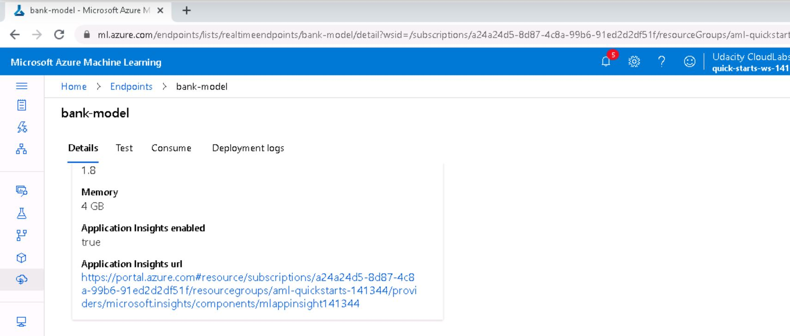
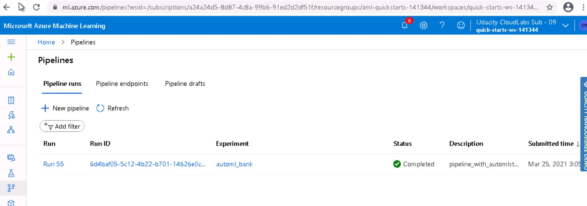

# Operationalizing Machine Learning

In this project we aim to deploy and consume a Machine Learning model on Microsoft Azure via Azure Machine Learning Studio. We first created an AutoML run to identify the best model for the given Bank-Marketing dataset. AutoML found out the Voting Ensemble as the best model which we deployed and consumed through the endpoint. We also documented our model's REST API using the swagger UI. To automate everything, we created a pipeline in the notebook and included all the steps that created an AutoML model. The best model is saved in pickel file. 

We tested our best running model using a test dataset and created a confusion matrix. We created a rest endpoint to this best model and scheduled an experiment on it.

## Architectural Diagram
The architecture of the process is shown below:

### Note:
1. All codes are available inside "starter_files" folder.
2. I had to complete the project in multiple attempts due to lab connectivity issues, VM access issues and slowness. Hence, user id for the project lab visible will be different in some of the screenshots.

## Key Steps

We used Bank marketing dataset taken from UCI Machine Learning repository. The data is related to direct marketing campaigns of a Portuguese banking institution.

The dataset was already present in Azure ML Studio.

We then created an AutoML run using ML Studio. We then created the experiment using Classification with "Explain best model" checked and wait for it to finish training. Below screenshot shows that the run was completed:

The best model is the VotingEnsemble model which was chosen by the AutoML experiment run. It gives highest accuracy:

Under Experiment tab, the completion status can be seen:

We then deployed our best model and enabled authentication. We use Azure Container Instance to do this. 

After this, we executed logs.py file to ensure that application insights is enabled for the deployed model.

Output of the logs.py is shown below:

Model can also be visible under the `Model` tab of ML studio:

We consumed the deployed model using Swagger. Azure provides a Swagger JSON file for deployed models. We executed the swagger.sh script to run the docker instance for swagger. After that, we set up a local server using the serve.py script. After opening the documentation in a browser window, we can see the different HTTP methods available.

After this, we modified the endpoint.py script with our REST API URL and primary key (for authentication) and executed it. 

We then tested the load of the model by running the benchmark.sh script.

We then created a pipeline for our machine learning model. We used the code in the Jupyter Notebook to create our pipeline

We can see the created pipeline under the pipeline section of studio:

We can view the graph of the pipeline created. REST endpoints are created:

We can see the pipeline endpoints too:

This endpoint is also available under the `Endpoints` tab of ML studio:

Real time endpoint:

We can view the run logs by using the `RunDetails` widget. To experience the graphical display of the `RunDetails` widget, I had to run the notebook in Jupyter.

Run logs from the `RunDetails` widget for the published pipeline:

One thing to note that, this graphical display is available in Jupyter Notebook. On ML studio, we can have the output like below:

We finally monitored the pipeline experiment run in experiments.

## Screen Recording

[Here](https://youtu.be/ro5GRCLZ8jA) is a demo of the endpoint and pipeline created in this project and consuming the REST service.

## Future Improvement Suggestions

1. We can include Deep Learning models for this task to get better results. 

2. We can think of mitigating class imbalance issue in the dataset.

3. Different encoding of categorical features and Normalization can be applied.
